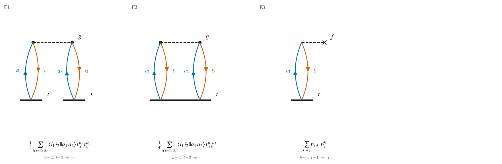
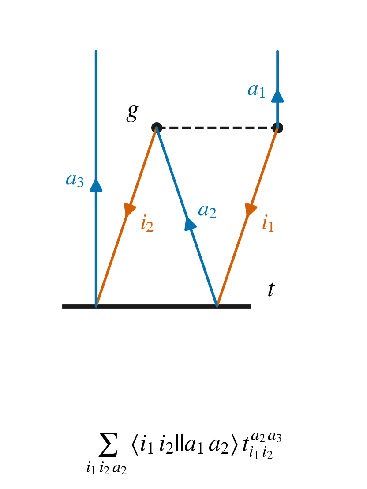

# SeQuant-Diagrams

Draw antisymmetrized-Goldstone (Brandow) diagrams from
[SeQuant](https://github.com/ValeevGroup/SeQuant) expressions. Primarily
intended for coupled-cluster diagrams.

> **Under development.** The diagrams it draws can be wrong. Check anything you
> intend to rely on against the algebra before you use it.

You write the term the way you already write it in SeQuant, using its
serialization DSL, and get a figure:

    python src/draw.py "1/4 g{i_1,i_2;a_1,a_2} t{a_1,a_2;i_1,i_2}" e2.pdf

One command. It runs the topology extractor and the renderer for you. The
output format comes from the suffix: `.pdf` (the default, and the one to keep
for typesetting), `.png`, or `.svg`. Give no suffix and you get a PDF.

Bring your own equations. Anything SeQuant can hand you, whether typed by hand
or produced by a derivation of your own, is valid input.

## Examples

The commands below write `.png` because these images are embedded in this
README. Drop the suffix for the vector version.

The full CCSD correlation energy, all three terms in one contact sheet:

    python src/draw.py "1/2 g{i_1,i_2;a_1,a_2} t{a_1;i_1} t{a_2;i_2} + 1/4 g{i_1,i_2;a_1,a_2} t{a_1,a_2;i_1,i_2} + f{i_1;a_1} t{a_1;i_1}" docs/ccsd-energy.png



Any `+`-separated sum becomes one panel per term, tagged `E1`, `E2`, … and
drawn to a common scale.

A single term, a T2 ring contribution, with its external lines `a_1` and `a_3`
running off the top:

    python src/draw.py "g{i1,i2;a1,a2} t{a2,a3;i1,i2}" docs/example-term.png



## Input: SeQuant's serialization DSL

Terms are parsed by `sequant::deserialize`, so the accepted syntax *is*
SeQuant's text serialization format. The
[I/O guide](https://valeevgroup.github.io/SeQuant/user/guide/io.html) has the
full grammar; in practice:

| you write | meaning |
|---|---|
| `g{i1,i2;a1,a2}` | tensor `name{<bra>;<ket>}`, here `⟨i₁i₂‖a₁a₂⟩` |
| `i1`, `i_1` | occupied (hole) index; the `_` is optional |
| `a1`, `a_1` | unoccupied (particle) index |
| `1/2`, `-1`, `3` | leading prefactor of the term |
| `A + B - C` | a sum; each summand gets its own panel |
| `g{i1,i2;a1,a2}:A-C-S` | symmetry annotation, parsed but unused, since a diagram follows from topology alone |

Indices live in SeQuant's minimal single-reference registry
(`mbpt::make_min_sr_spaces`): `i` occupied, `a` unoccupied, `p` their union.
A `p` index is rejected rather than guessed at, because a Brandow diagram has
no glyph for a line that is neither hole nor particle.

Tensor names carry meaning. `f` is drawn as a one-body vertex, `g` as a
two-body vertex, `t` as an amplitude bar, `t⁺` as a de-excitation amplitude
above the interaction, and `Â` as the projection onto the target manifold.
Any other label is an error rather than a guess.

## Reading the diagrams

* Hole lines run **down** and are orange, particle lines run **up** and are blue.
* A **dashed line** joins the two halves of a two-body (`g`) vertex. A one-body
  (`f`) vertex ends in a dashed stub with a **×**.
* A **heavy horizontal bar** is a `t` amplitude.
* Free line ends at the top are external (target) indices. An external
  hole/particle pair on the same amplitude closes through the target
  projection, drawn as a quasiloop.
* Each panel is captioned with the algebraic term it draws, and with the sign
  rule `(-1)^(h-l)` for `h` hole lines and `l` loops, evaluated for that
  diagram. Terms whose loops cannot be closed carry no sign.

Conventions follow Shavitt & Bartlett, see [References](#references).

## Build

    cmake -S . -B build && cmake --build build

That fetches and builds SeQuant once via
[FetchContent](https://cmake.org/cmake/help/latest/module/FetchContent.html).
CMake ≥ 3.24 is required for `FIND_PACKAGE_ARGS`, which lets an already
installed SeQuant short-circuit the download.

Rendering needs Python 3 and matplotlib:

    pip install -r requirements.txt

## Under the hood

`draw.py` is the front door. It locates `sq-diagram-topology` (via
`$SQ_DIAGRAM_BIN`, `$PATH`, then `build/`), runs it, and renders the result.

`sq-diagram-topology` parses one term or sum and prints the diagram topology as
JSON. Run it yourself if you want to render some other way, and hand the JSON
back to `draw.py` from a file or on stdin:

    build/sq-diagram-topology "f{i1;a1} t{a1;i1}" | python src/draw.py - out.pdf

A single term prints one JSON object, a sum prints an array of them:

```json
{
  "term": "f{i1;a1} t{a1;i1}",
  "prefactor": "1",
  "targets": {"bra": [], "ket": []},
  "vertices": [
    {"id": 0, "kind": "fock", "label": "f", "bra": ["i_1"], "ket": ["a_1"]},
    {"id": 1, "kind": "ampl", "label": "t", "bra": ["a_1"], "ket": ["i_1"]}
  ],
  "lines": [
    {"index": "i_1", "type": "hole", "external": false,
     "endpoints": [{"vertex": 0, "slot": "bra", "pos": 0},
                   {"vertex": 1, "slot": "ket", "pos": 0}]}
  ]
}
```

`kind` is one of `fock`, `eri`, `ampl`, `deexc`. `type` is `hole` or
`particle`, and `external` marks a line with only one endpoint.

## Test

    pip install -r requirements.txt && python -m pytest tests/ -v

## Known limits

Amplitude rank is not capped, so CCSDT-level terms such as
`1/2 g{i2,i3;a2,a3} t{a1,a2,a3;i1,i2,i3}` do draw, but they are untested
territory and the layout has no crossing minimization, so busy terms can come
out tangled. Disconnected terms and spin-traced (closed-shell) expressions are
not handled.

## References

* B. H. Brandow, *Linked-Cluster Expansions for the Nuclear Many-Body Problem*,
  [Rev. Mod. Phys. **39**, 771 (1967)](https://doi.org/10.1103/RevModPhys.39.771).
* I. Shavitt and R. J. Bartlett, *Many-Body Methods in Chemistry and Physics:
  MBPT and Coupled-Cluster Theory*, Cambridge University Press (2009), source of
  the diagram rules used here.
* SeQuant: [repository](https://github.com/ValeevGroup/SeQuant) ·
  [documentation](https://valeevgroup.github.io/SeQuant/) ·
  [J. Chem. Phys. **164**, 142502 (2026)](https://doi.org/10.1063/5.0311913).

## License

MIT, see [LICENSE](LICENSE). SeQuant itself is LGPL-3.0 and is fetched at build
time, not vendored here.
